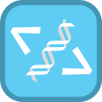
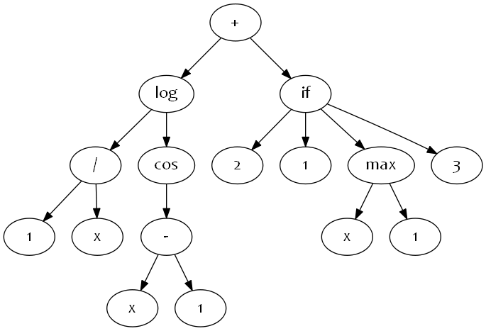

# Genetica.NET
> A genetic programming library written in C#

Genetica is a .NET open-source *genetic programming* (GP) library written entirely in C#. In general terms, GP allows a population of *candidate programs* to change over time by means of operators inspired from natural evolution such as *selection*, *mutation* and *crossover*. The evolutionary process is guided by a *fitness function* that assesses how fit a program is (usually its output) in regard to some external objective function.

Currently, Genetica.NET supports the evolution of programs representing *mathematical expressions* in a syntactic tree form. Mathematical programs combine *primitives* taken from a set of *terminals*, representing input scalar values, and several mathematical *functions*.

**Table of contents**

- [About](#about)
- [API Documentation](#api-documentation)
- [Packages and Dependencies](#packages-and-dependencies)
- [Installation](#installation)
- [Features](#features)
- [Examples](#examples)
- [See Also](#see-also)

------

## About

Genetica.NET is open-source under the [MIT license](https://github.com/pedrodbs/Genetica/blob/master/LICENSE.md) and is free for commercial use.

- Source repository: https://github.com/pedrodbs/Genetica
- Issue tracker: https://github.com/pedrodbs/Genetica/issues

Supported platforms:

- .Net 4.5+ on Windows, Linux and Mac

## API Documentation

- [HTML](https://pedrodbs.github.io/Genetica/)
- [Windows Help file (CHM)](https://github.com/pedrodbs/Genetica/raw/master/docs/Genetica.NET.chm)
- [PDF document](https://github.com/pedrodbs/Genetica/raw/master/docs/Genetica.NET.pdf)

## Packages and Dependencies

The following packages with the corresponding dependencies are provided:

- **Genetica:** core package, including mathematical programs support and all GP operators. 
  - [Math.NET Numerics](https://nuget.org/profiles/mathnet/)
- **Genetica.D3:** package to export tree-based programs to json files to be visualized with d3.js. 
  - [Json.NET](https://www.nuget.org/packages/Newtonsoft.Json/)
- **Genetica.Graphviz:** package to create tree (DAG) representations for tree-based programs and export them to image files via [Graphviz](https://www.graphviz.org/).
  - [QuickGraph](https://github.com/pedrodbs/quickgraph) (forked to allow colored edges and vertexes when exporting to Graphviz dot format)

## Installation

Currently, you can `git clone` the Genetica.NET [source code](https://github.com/pedrodbs/Genetica) and use an IDE like VisualStudio to build the corresponding binaries. NuGet deployment is planned in the future.

##Getting started

Start by creating the *fitness function* to evaluate and compare your programs:

```c#
class FitnessFunction : IFitnessFunction<MathProgram>{...}
var fitnessFunction = new FitnessFunction();
```

Define the *primitive set*:

```c#
var variable = new Variable("x");
var primitives = new PrimitiveSet<MathProgram>(
    new List<MathProgram> {variable, new Constant(0), ...},
    MathPrimitiveSets.Default.Functions);
```

Create and initiate a *population* of candidate programs:

```c#
var population = new Population<MathProgram, double>(
    100, 
    primitives,
    new GrowProgramGenerator<MathProgram, double>(), 
    fitnessFunction,
    new TournamentSelection<MathProgram>(fitnessFunction, 10),
    new SubtreeCrossover<MathProgram, double>(),
    new PointMutation<MathProgram, double>(primitives), 
    ...);
population.Init(new HashSet<MathProgram> {...});
```

*Step* the population for some number of generations:

```c#
for (var i = 0; i < 500; i++)
    population.Step();
```

Get the *solution* program, *i.e.*, the one attaining the highest fitness:

```c#
var solution = population.BestProgram;
```

## Features

- Creation of programs as *mathematical expressions*

  - **Terminals:** constant and variables
  - **Functions:** arithmetic functions, sine, cosine, min, max, log, exponentiation and 'if' conditional operator

- *Genetic operators*

  - **Selection:** tournament, roulette wheel (even and uneven selectors), stochastic
  - **Crossover:** uniform, one-point, sub-tree, context-preserving, stochastic
  - **Mutation:** point, sub-tree, hoist, shrink, swap, simplify, fitness simplify, stochastic
  - **Generation:** full-depth, grow, stochastic

- Population class implementing a standard steady-state *GP evolutionary procedure*

- Rank (linear and non-linear) *fitness functions*

- Measure the *similarity* between two programs

  - **Similarity measures:** value (according to the range of variables), primitive, leaf, sub-program, sub-combination, prefix and normal notation expression edit, tree edit, common region, average

- *Conversion* of programs to/from strings

  - *Normal* notation, *e.g.*: 
    ```c#
    var converter = new MathExpressionConverter(MathPrimitiveSets.Default);
    var program = converter.FromNormalNotation("min(3,(2-1))");
    ```

  - *Prefix* notation, *e.g.*:
    ```c#
    var program = converter.FromPrefixNotation("(min 3 (- 2 1))");
    ```

- Program *simplification* to remove redundancies and evolutionary noise, *e.g.*:
    ```c#
    converter.FromNormalNotation("min((x*0),(3-2))").Simplify(); // -> 1
    converter.FromNormalNotation("(x+(x+(x+x)))").Simplify(); // -> (x*4)
    converter.FromNormalNotation("(2+((x*x)*x))").Simplify(); // -> ((x^3)+2)
    converter.FromNormalNotation("(0?1:log(3,(1+0)):max(3,(cos(0)-(3/1))))").Simplify(); // -> 1
    converter.FromNormalNotation("((x*0)?(x-0):log(3,0):max(3,1))").Simplify(); // -> x
    ```

- *Visual instruments* (trees) to analyze the structure of sets of programs (*e.g.*, a population):

  - Information, symbol, ordered symbol, sub-program


- **Graphviz export**

  - Export a program's tree representation to image file with [Graphviz](https://www.graphviz.org/) (requires Graphviz installed and *dot* binary accessible from the system's path), *e.g.*:

    ```c#
    using Genetica.Graphviz;
    using QuickGraph.Graphviz.Dot;
    ...
    var program = converter.FromNormalNotation("(log((1/x),cos((x-1)))+(2?1:max(x,1):3))");
    program.ToGraphvizFile(".", "file", GraphvizImageType.Png);
    ```

    would produce the following image:

    


## Examples

Example code can be found in the [src/Examples](https://github.com/pedrodbs/Genetica/tree/master/src/Examples) folder in the [repository](https://github.com/pedrodbs/Genetica).

- **FunctionRegression:** an example of performing symbolic regression to search the space of mathematical expressions and find the program that best fits a given set of points generated by some function (unknown to the algorithm). Programs are evaluated both in terms of accuracy (lower RMSE between actual and predicted output) and simplicity (shorter expressions are better).
- **ProgramVisualizer:** a Windows.Forms application that allows visualizing programs converted from a user-input expression written in normal or prefix notation. It also shows characteristics of the program such as its length, depth, or sub-programs. Allows exporting the current program to an image file via Graphviz.

## See Also

**References**

1. McPhee, N. F., Poli, R., & Langdon, W. B. (2008). [Field guide to genetic programming](http://digitalcommons.morris.umn.edu/cgi/viewcontent.cgi?article=1001&context=cs_facpubs). 
2. Koza, J. R. (1994). [Genetic programming as a means for programming computers by natural selection](https://doi.org/10.1007/BF00175355). *Statistics and computing*, *4*(2), 87-112.
3. Pohlheim, H. (1995). *[The multipopulation genetic algorithm: Local selection and migration]( http://www.pohlheim.com/Papers/mpga_gal95/gal2_3.html)*. Technical report, Technical University Ilmenau.

**Other links**

- [Genetic programming (Wikipedia)](https://en.wikipedia.org/wiki/Genetic_programming)
- [Graphviz](https://www.graphviz.org/)
- [D3.js](https://d3js.org/)
- http://www.geatbx.com/docu/algindex-02.html#P249_16387


Copyright &copy; 2018, [Pedro Sequeira](https://github.com/pedrodbs)